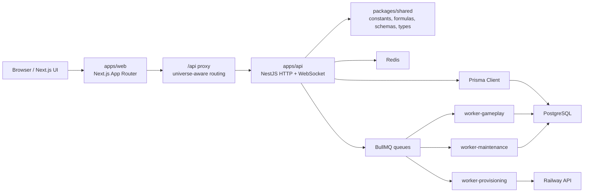

# Architecture

Arborisis is a persistent multiplayer strategy game. The architecture favors deterministic server simulation, explicit domain boundaries, and replay-safe asynchronous workflows.

---

## System Overview

The browser is never authoritative. The API validates intentions, settles state, persists business jobs, and schedules queue work. Workers finalize persisted jobs and run recovery sweeps.

---

## Monorepo Boundaries

| Workspace         | Owns                                                                                           | Must not own                                                                        |
| ----------------- | ---------------------------------------------------------------------------------------------- | ----------------------------------------------------------------------------------- |
| `packages/shared` | Gameplay constants, formulas, enums, Zod schemas, public transport types                       | Database access, Nest services, React UI                                            |
| `apps/api`        | Auth, authorization, game engine, persistence orchestration, queues, workers, WebSocket events | Hardcoded balance, trusted client-side outcomes                                     |
| `apps/web`        | UI, navigation, API proxy, rendering, 3D scenes, client state                                  | Game authority, persistence, secret-bearing server logic beyond proxy/session needs |
| `prisma`          | Database schema, migrations, seed                                                              | Business logic                                                                      |

---

## Runtime Layers

### Shared Gameplay Layer

Key files:

- `packages/shared/src/constants.ts`
- `packages/shared/src/formulas.ts`
- `packages/shared/src/enums.ts`
- `packages/shared/src/schemas.ts`
- `packages/shared/src/types.ts`

This package is the contract between API, web, tests, and persistence-adjacent code. If a gameplay number appears outside shared, treat it as suspicious.

### API Layer

The API is organized by domain modules:

| Area                   | Modules                                                              |
| ---------------------- | -------------------------------------------------------------------- |
| Identity and users     | `auth`, `users`, `email`, `admin`                                    |
| Core game              | `game`, `defenses`, `moons`, `commanders`, `production-lines`        |
| Economy                | `inventory`, `market`, `crafting`, `trade-routes`                    |
| Social                 | `alliances`, `diplomacy`, `chat`, `notifications`                    |
| Combat and exploration | `pve`, `pvp`, `npc`                                                  |
| Runtime/platform       | `health`, `queue`, `provisioning`, `universe`, `events`, `anticheat` |

Global guards:

- `OriginGuard`
- `JwtAuthGuard`
- `UserThrottlerGuard`

Core runtime modules:

- `RuntimeCoreModule`: config validation, logging, BullMQ connection, Redis, Prisma.
- `AppModule`: HTTP API composition.
- `WorkerModule`: worker composition based on `WORKER_ROLE`.

### Web Layer

The web app uses Next.js App Router:

- Public/auth pages: landing, login, register, forgot/reset password, verify email.
- Universe selection: `apps/web/src/app/universes`.
- Game shell: `apps/web/src/app/(game)`.
- API proxy: `apps/web/src/app/api/[...path]/route.ts`.
- 3D/game visuals: `apps/web/src/components/three`.

The web may optimize presentation, but server responses remain the source of truth.

---

## Server-Authoritative Flow

Typical mutation:

1. Web sends an intention, such as "build this", "start research", or "send fleet".
2. API authenticates the user.
3. API validates input with Zod.
4. API resolves universe/player/planet scope.
5. API settles time-based state before making a decision.
6. API checks shared constants/formulas.
7. API writes state transactionally.
8. API schedules BullMQ work if completion is delayed.
9. Worker finalizes from persisted state when due.
10. Recovery sweeps finalize overdue work after downtime.

The queued job is a wake-up signal, not the source of truth.

---

## Queue and Worker Model

Worker roles:

| Role           | Module               | Responsibility                                        |
| -------------- | -------------------- | ----------------------------------------------------- |
| `gameplay`     | `ProcessorsModule`   | Gameplay processors and regular recovery cycles       |
| `provisioning` | `ProvisioningModule` | Railway universe provisioning and reconciliation      |
| `maintenance`  | `MaintenanceModule`  | Global sweeps, NPC maintenance, long-running recovery |

Queue names live in `apps/api/src/modules/queue/queue.constants.ts`.

Important workflow rules:

- Persist the business job before adding a queue job.
- Include `universeId` in finalization payloads where applicable.
- Use database state for finalization decisions.
- Finalizers must tolerate duplicate execution.
- Sweeps must be safe to run repeatedly and concurrently under distributed locks.

---

## Data Model Themes

Prisma owns persistence for:

- users, sessions, roles, auth tokens, TOTP/password reset flows
- universes and universe routing
- planets, resources, buildings, research, queues, fleets
- expeditions, PVE/PVP missions, NPC encounters
- alliances, diplomacy, chat, moderation
- market, inventory, crafting, production lines, trade routes
- achievements, quests, seasons, engagement hooks
- notifications and operational jobs

Enum synchronization is mandatory between `prisma/schema.prisma` and `packages/shared/src/enums.ts`.

---

## Idempotency Contract

A finalizer is acceptable only if all are true:

- It checks persisted job status before applying effects.
- It can be called after the job is already complete.
- It can recover from a missing or delayed BullMQ event.
- It does not trust resource values from a client or queue payload.
- It updates related entities in a transaction when multiple writes must agree.

This contract matters more than queue timing precision.

---

## Adding New Features

### Feature Touching Gameplay Rules

Start in shared:

1. Add constants or formulas.
2. Add schemas and types.
3. Update enums if needed.
4. Add shared tests.
5. Implement API behavior.
6. Add web presentation.

### Feature Touching Persistence

Start in Prisma:

1. Update schema.
2. Generate a migration.
3. Update seed if needed.
4. Update services and DTOs.
5. Add tests around migration-sensitive behavior.

### Feature Touching Timers

Start with the lifecycle:

1. What is persisted immediately?
2. What wakes the system later?
3. What finalizes the business result?
4. What sweep recovers missed work?
5. What proves duplicate finalization is harmless?

---

## Review Checklist

- Is authority on the server?
- Are balance values imported from shared?
- Are enums synchronized?
- Are inputs validated with Zod?
- Are state-changing operations transactional where needed?
- Is delayed work idempotent?
- Can workers recover after downtime?
- Are new environment variables documented?
- Are tests focused on behavior and risk?
